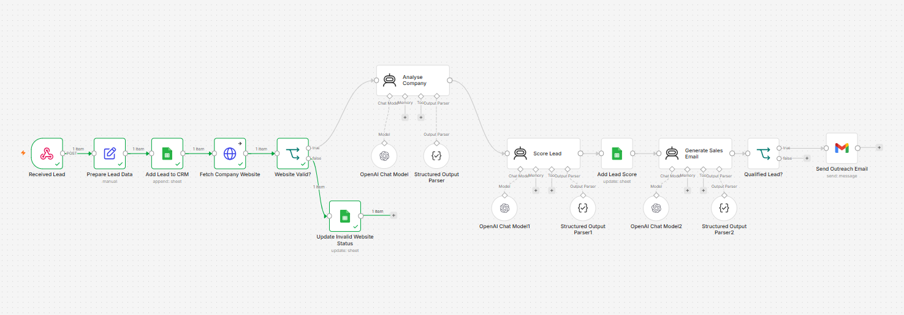

# 🤖 AI Lead Qualification & Outreach Automation

An AI-powered lead qualification workflow built using **n8n**, **OpenAI**, **Google Sheets**, **Gmail**, and **HTTP Request**.

The workflow automatically analyzes a company's website, scores the lead based on AI analysis, updates a CRM, and sends personalized outreach emails only to qualified leads.

---

## 🚀 Features

- Capture leads via Webhook
- Store lead information in Google Sheets
- Fetch and analyze company website content
- AI-powered lead qualification
- Generate lead score (0–100)
- Update CRM with qualification status
- Send personalized sales emails to qualified leads
- Handle invalid website URLs gracefully
- Prevent emails from being sent to unqualified leads

---

## 🛠️ Tech Stack

- n8n
- OpenAI
- Google Sheets
- Gmail
- HTTP Request
- Webhooks

---
## 🏗️ Workflow Architecture

```text
Lead Submission (Webhook)
          │
          ▼
Google Sheets (Save Lead)
          │
          ▼
HTTP Request (Fetch Website)
          │
          ▼
Website Valid?
     │              │
   Yes             No
     │              │
     ▼              ▼
AI Company     Update Invalid
Analysis       Website Status
     │
     ▼
AI Lead Scoring
     │
     ▼
Update Google Sheets
     │
     ▼
Qualified Lead?
     │              │
   Yes             No
     │              │
     ▼              ▼
Generate Sales    End Workflow
Email
     │
     ▼
Send Email (Gmail)
```

## ⚙️ Workflow Steps

1. Receive lead details via Webhook.
2. Store lead information in Google Sheets.
3. Fetch the company website.
4. Validate website availability.
5. Analyze company using AI.
6. Score the lead using AI.
7. Update Google Sheets with lead score and status.
8. Check if the lead is qualified.
9. Generate a personalized sales email.
10. Send the email using Gmail.
11. If the website is invalid, update the CRM and stop the workflow.

---

## 📊 Business Value

- Automates lead qualification
- Reduces manual research
- Prioritizes high-value leads
- Generates personalized outreach automatically
- Improves sales team efficiency

---
## 📸 Workflow


