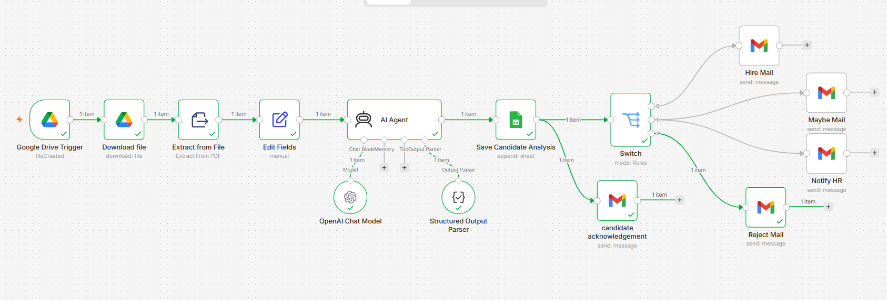

# 📄 HireFlow AI Resume Screening

An AI-powered resume screening workflow built using **n8n**, **OpenAI**, **Google Drive**, **Google Sheets**, and **Gmail**.

## 🚀 Features

- Automatically detects newly uploaded resumes
- Extracts text from PDF resumes
- Analyzes resumes using AI
- Generates Match Score, Confidence Score & Recommendation
- Creates AI Reasoning and Candidate Summary
- Stores candidate details in Google Sheets
- Saves resume link for HR
- Sends candidate acknowledgement email
- Sends Hire / Maybe / Reject emails
- Notifies HR for manual review of "Maybe" candidates

## 🛠 Tech Stack

- n8n
- OpenAI Chat Model
- Google Drive
- Google Sheets
- Gmail

## 🔄 Workflow

Google Drive → PDF Extraction → AI Resume Analysis → Google Sheets → Candidate Acknowledgement → Hire / Maybe / Reject Decision → HR Notification

## 🏗️ Architecture Diagram

```text
Google Drive Trigger
        │
        ▼
Download Resume
        │
        ▼
Extract PDF Text
        │
        ▼
Edit Fields
        │
        ▼
AI Resume Analysis
        │
        ▼
Save Candidate Analysis
        │
        ├──────────────► Candidate Acknowledgement
        │
        ▼
Recommendation Switch
   │         │         │
   ▼         ▼         ▼
Hire      Maybe      Reject
 Email      │          Email
            ▼
       Notify HR
```
## 📸 Workflow



## 💼 Business Use Case

Automates resume screening, reduces manual effort, and helps HR identify suitable candidates faster.
