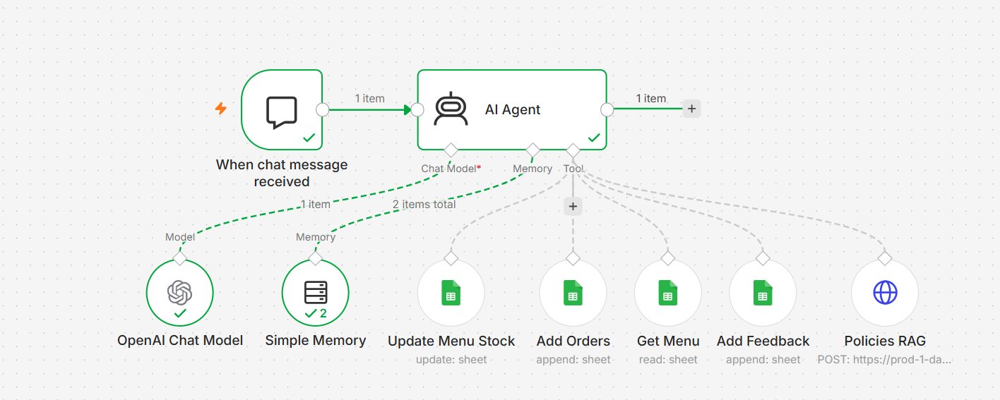

# 🍽️ Flavro Restaurant AI Assistant

An AI-powered restaurant assistant built using **n8n**, **OpenAI**, **Pinecone**, and **Google Sheets**. The assistant helps customers browse the menu, place food orders, answer restaurant policy questions, and submit feedback through a conversational AI interface.

## 🚀 Features

- 🍽️ Display restaurant menu
- 🛒 Place customer orders
- 📦 Update menu stock automatically
- 📖 Answer restaurant policy questions using Pinecone (RAG)
- ⭐ Collect customer feedback
- 💬 AI-powered conversations
- 🧠 Maintain conversation context with memory

## 🛠️ Tech Stack

- n8n
- OpenAI Chat Model
- AI Agent
- Pinecone (RAG)
- Google Sheets
- Simple Memory

## 📂 Workflow

1. Customer sends a message.
2. AI Agent understands the request.
3. Retrieves menu information from Google Sheets.
4. Places customer orders.
5. Updates menu stock automatically.
6. Answers restaurant policy questions using Pinecone.
7. Stores customer feedback.
8. Responds with an AI-generated response.

## 📸 Workflow

